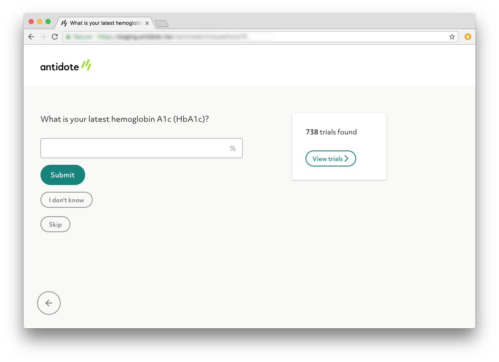
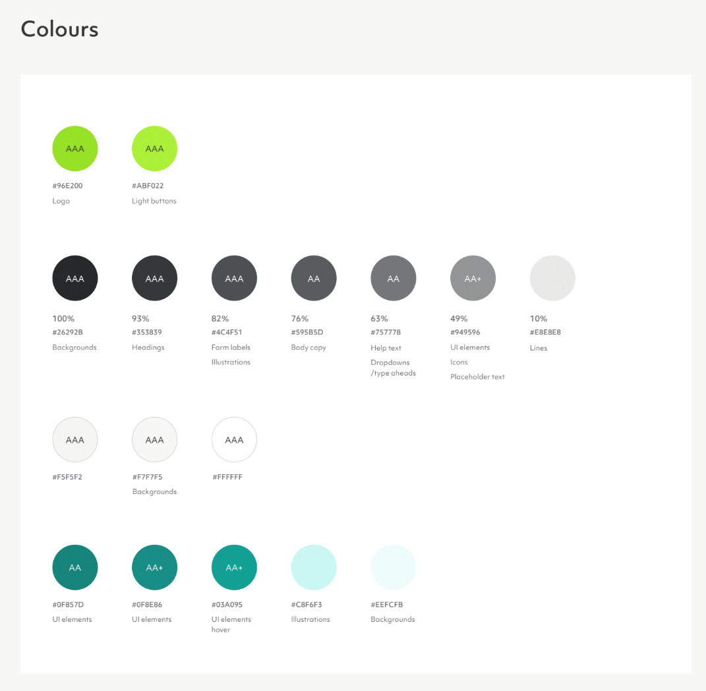
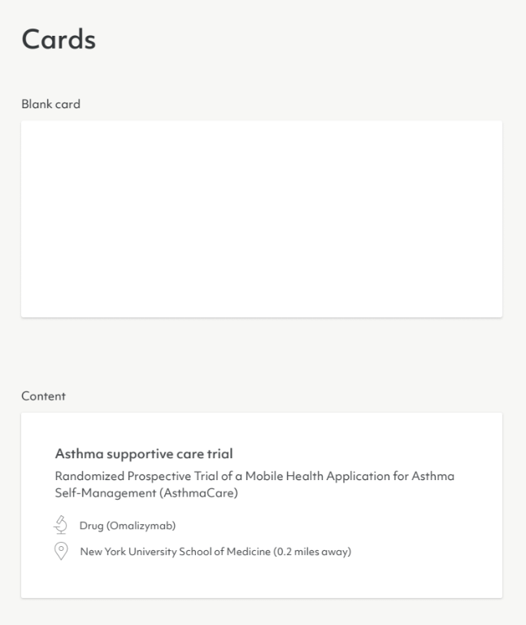
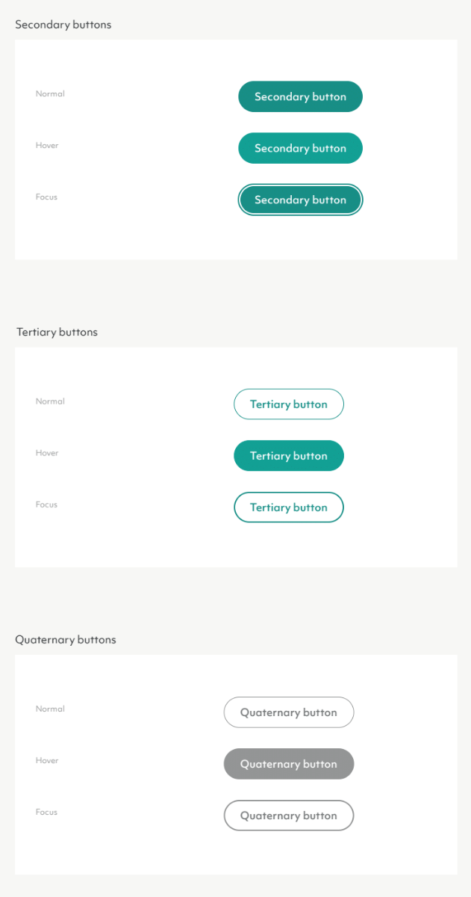
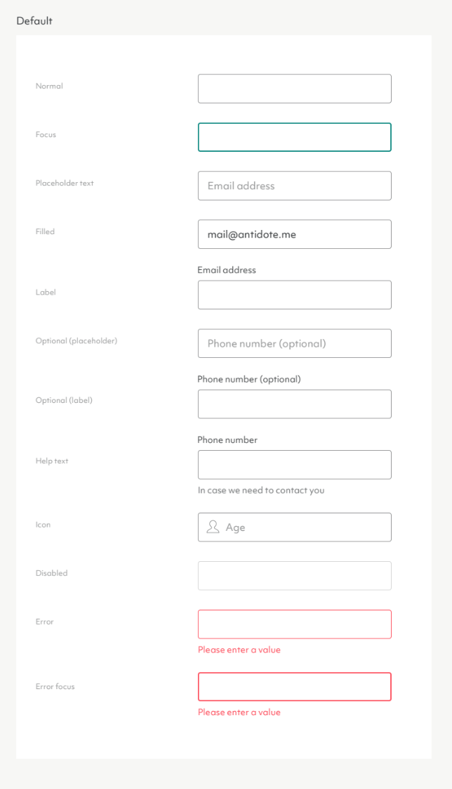

# UI Development test

## Summary
The purpose of this test is to help us get an impression of your approach to
building design systems for the web. There are no right or wrong submissions
that we're looking out for. We're interested in getting a sense of your
understanding of ideas like componentisation, reusability, performance,
developer experience, and of course, the effect all of these have on
product development and user experience.

## Task
Included in this test is a mockup you might be expected to work from when
building a new product, as well as snapshots from our product style guide
showing some of the individual components used in the mockup. (Please note
that we've already built this product and these components, so we won't be
using this test as a way to get some free work done.)

**Using the samples from our style guide as a reference, your task is to build
the individual components shown in the product mockup, and to then combine
those components into a single view reproducing the content of the mockup.**

_Note: It's not expected that you build out all the variants of each UI
component in the style guide samples. You should only build what you
need for the mockup shown below._

You can use any approach you deem fit for purpose in terms of languages,
libraries, etc. We use React with Styled Components ourselves, but you're
welcome to submit plain HTML and CSS, or something in another libary which
you might be more familiar with. (If the work you submit uses a tool or
library we're not familiar with, we'll ask you to give us a brief walkthrough
of it.) While experience with React is a big plus for us, the only requirement
for this test in terms of technology you use is that it be something pertinent
to front end web development.

The components and view you build do NOT have to be functional in any way aside
from being able to be rendered on a web page; at this stage we are just
interested in how you implement UI designs. Having said that, if you'd like to
leave any suggestions as to how the components would work at a functional level,
you're welcome to do so. Additionally, don't worry about making your components
pixel perfect to the mockup — if they end up resembling the mockup without
nailing every box shadow and border radius, that's fine.

**Please do not spend more than a 2–3 hours on this task (unless you really
want to), even if that means the task is incomplete (there's no penalty for
this). Once you've finished building the components and view, please include
a brief readme describing your approach to the task, improvements you might
make given more time, and anything you struggled with. Additionally, if any
dependencies need to be installed or run in order to load the final view in
a browser, please include relevant documentation covering this.**

## Submission
Please submit a zip file containing:

- Source code
- Public code (if applicable)
- Readme with the information described above

Alternatively, you can upload your code to GitHub, GitLab, or another hosted
version control repo, providing it is publically accessible so we can review
it. Just pass on a link for us to visit.

## Mockup

## Style guide samples

### Colours

### Cards

### Buttons

### Inputs

